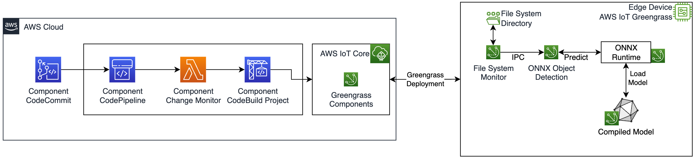
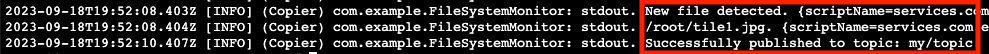
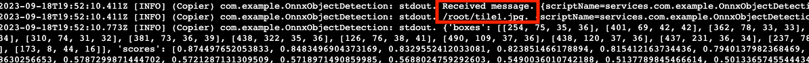

## Greengrass IoT Edge Runtime - Event Driven ML Inference

This repository demonstrates building, deploying, and managing software at the edge. This solution demonstrates event driven ML inference using AWS IoT Greengrass. The use case assumes an upstream data acquisition process makes raw data available for inference on a specified file system directory. We use a sample Greengrass component to monitor that directory and trigger our inference process via [Greengrass Interprocess Communication (IPC)](https://docs.aws.amazon.com/greengrass/v2/developerguide/interprocess-communication.html).



## Setup

The code provided in the repository represents an AWS Cloud Development Kit (CDK) project. If you are unfamiliar with CDK, see the following [CDK Resource](https://docs.aws.amazon.com/cdk/v2/guide/getting_started.html).

The goal is to move the repository from AWS Samples to a new remote destination which is in a CodeCommit repository in your account.

1. Create a CodeCommit repository in your AWS account similar to the following
   
2. Copy the repository ARN from Settings -> Repository ARN
   
3. Configure the cdk.json file with your region, account number, and Repository ARN
4. In the components directory of this repo, set the &lt;REGION&gt; in each of components/com.example.\*/gdk-config.json
5. Note the CodeCommit HTTPS Clone URL similar to the following:
   
6. Move the repository from AWS Samples into CodeCommit with the following

```
git clone https://github.com/aws-samples/greengrass-iot-edge-runtime.git
cd greengrass-iot-edge-runtime
git init
git remote add destination <CODECOMMIT_HTTPS_URL>
git push destination
```

6. Lastly, we need to deploy the CDK stack to our account.

```
python3 -m venv .venv
source .venv/bin/activate
python3 -m pip install -r requirements.txt
cdk deploy
```

The deploy process takes about 15 minutes.

### Continuous Integration and Continuous Delivery (CI/CD)

This repository utilizes CI/CD to simplify the process for building, managing, and deploying AWS IoT Greengrass components. After the CDK deploy has finished, we can verify that we have five CodePipeline pipelines with similar names to the image below.

An AWS CodePipeline will be dynamically created for each component which is checked into the **components/** directory of this repository. An AWS Lambda function will determine which components are impacted by new commits and need to be rebuilt. For example, the following image shows how a commit may impact just one out of the four component build pipelines.


This process results in selective builds which can help to manage and scale our code development process. This pattern is described in detail in the following [blog post](https://aws.amazon.com/blogs/iot/trigger-aws-iot-greengrass-component-deployments-from-aws-codecommit/).

### Greengrass Deployment

This section assumes you have a Greengrass device in your account. See the following if you need help setting one up [Setting up an Edge Device with AWS IoT Greengrass](https://docs.aws.amazon.com/greengrass/v2/developerguide/setting-up.html).

In AWS IoT Core we expect to see our components built out similar to the following


1. We create a Greengrass deployment and set the Deployment target to our device as follows
   
2. We can select the components which are built from our pipeline
   
3. We can optionally configure the component recipes before deployment, we will skip that for now. We click Next and then Deploy
   
4. We confirm our deployment has a status of Completed
   

### Demo on Edge Device

From the Edge Device running AWS IoT Greengrass, we can start the demo by moving a sample image to the directory which we are monitoring, set DEPLOYMENT_VERSION according to your environment

```
cp /greengrass/v2/packages/artifacts-unarchived/com.example.OnnxObjectDetection/DEPLOYMENT_VERSION/com.example.OnnxObjectDetection/images/bus.jpg /root/bus.jpg
```

Next, we verify the log messages of our File System Monitor Component, we expect to see a log statement which shows that our bus.jpg was detected by the monitoring process. We also note that the message was published to our IPC topic.

```
cat /greengrass/v2/logs/com.example.FileSystemMonitor.log
```



We can then verify the log message of our Object Detection process received the IPC message and the results of the inference against the specified image.

```
cat /greengrass/v2/logs/com.example.OnnxObjectDetection.log
```



## Security

See [CONTRIBUTING](CONTRIBUTING.md#security-issue-notifications) for more information.

## License

This library is licensed under the MIT-0 License. See the LICENSE file.
