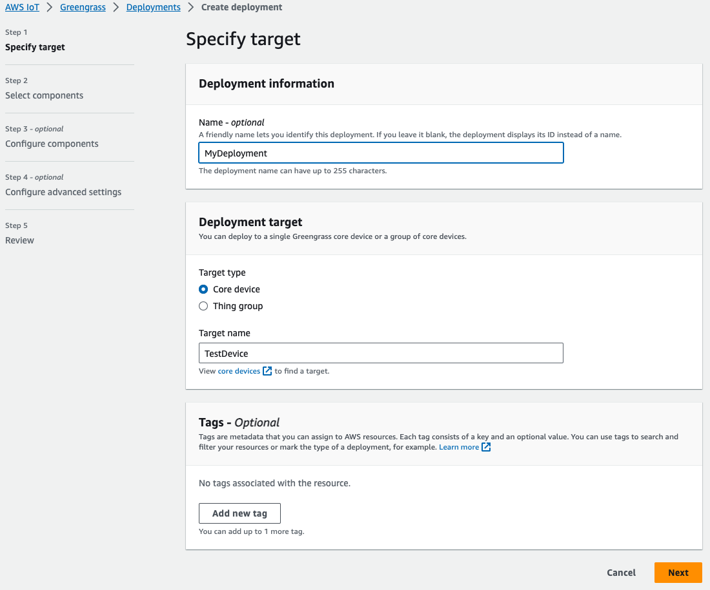

## Greengrass IoT Edge Runtime - Event Driven ML Inference

This repository demonstrates building, deploying, and managing software at the edge using AWS IoT services. This solution demonstrates Event Driven Machine Learning inference using AWS IoT Greengrass. The use case assumes we want to monitor a specified file system directory for new data. When a new image is available, an event is sent to the Object Detection Component so that it can run inference on that image. We use a sample Greengrass Component to monitor the specified directory and trigger our Object Detection process via [Greengrass Interprocess Communication (IPC)](https://docs.aws.amazon.com/greengrass/v2/developerguide/interprocess-communication.html). The Object Detection process will perform inference and write insights to the Component log.

This repository utilizes Continuous Integration and Continuous Delivery (CI/CD) to simplify the process for building and managing AWS IoT Greengrass Components. The focus of this repository is in on building Event Driven Inference using Greengrass, see the following [blog post](https://aws.amazon.com/blogs/iot/trigger-aws-iot-greengrass-component-deployments-from-aws-codecommit/) for more details on the CI/CD pipeline.


## Prerequisites

This workshop assumes you have AWS Cloud Development Kit (CDK) installed and have bootstrapped to your working region. If you are unfamiliar with CDK, see the following [AWS CDK Resource](https://docs.aws.amazon.com/cdk/v2/guide/getting_started.html).

This workshop assumes you have a Greengrass device in your account. See the following for [setting up an Edge Device with AWS IoT Greengrass](https://docs.aws.amazon.com/greengrass/v2/developerguide/setting-up.html).

## Setup

The code provided in the repository represents a CDK project. The goal is to move the repository from AWS Samples to an AWS CodeCommit repository in your account.

1. First, create an AWS CodeCommit repository in your AWS account similar to the following
   
2. Note the repository ARN from Settings -> Repository ARN
   
3. If you haven't done so, clone this AWS Samples repo in your development environment

```
git clone https://github.com/aws-samples/greengrass-iot-edge-runtime.git
```

3. Configure the cdk.json file with your region, account number, and CodeCommit Repository ARN
4. In the components directory of this repo, set the &lt;REGION&gt; in each of components/com.example.\*/gdk-config.json
5. Note the CodeCommit HTTPS Clone URL similar to the following:
   
6. Move the repository from AWS Samples into CodeCommit with the following

```
cd greengrass-iot-edge-runtime
git init
git remote add destination <CODECOMMIT_HTTPS_URL>
git add *
git commit -m "First commit"
git push destination
```

6. Lastly, we need to deploy the CDK stack to our account.

```
python3 -m venv .venv
source .venv/bin/activate
python3 -m pip install -r requirements.txt
cdk deploy
```

The deploy process takes about 15 minutes.

### Continuous Integration and Continuous Delivery (CI/CD)

After the CDK deploy has finished, we can verify that we have five CodePipeline pipelines with similar names to the image below.

An AWS CodePipeline will be dynamically created for each Component which is checked into the **components/** directory of this repository. An AWS Lambda function will determine which Components are impacted by new commits and need to be rebuilt. For example, the following image shows how a commit may impact just one out of the four Component build pipelines.


This process results in selective builds which can help to manage and scale our code development process.

### Greengrass Deployment

In AWS IoT Core -> Greengrass, we expect to see our Components built out similar to the following


1. We create a Greengrass Deployment and set the Deployment target to our device as follows
   
2. We can select the Components which are built from our pipeline
   
3. We can optionally configure the Component recipes before deployment, we will skip that for now. We click Next and then Deploy
   
4. We confirm our Deployment has a status of Completed
   

### Demo on Edge Device

From the Edge Device running AWS IoT Greengrass, we can start the demo by moving the sample image to the directory which is being monitoring so that File System Monitor will trigger the Object Detection Component.


This sample image has been bundled with our Object Detection Component, we need to move it to the directory which is being monitored. Make sure to set DEPLOYMENT_VERSION according to your environment. The default directory to monitor is /root.

```
cp /greengrass/v2/packages/artifacts-unarchived/com.example.OnnxObjectDetection/DEPLOYMENT_VERSION/com.example.OnnxObjectDetection/images/bus.jpg /root/bus.jpg
```

Next, we verify the log messages of our File System Monitor Component, we expect to see a log statement which shows that our image was detected by the monitoring process. We also note that the message was published to our IPC topic.

```
cat /greengrass/v2/logs/com.example.FileSystemMonitor.log
```


We can then verify the log message of our Object Detection process received the IPC message and the results of the inference against the specified image.

```
cat /greengrass/v2/logs/com.example.OnnxObjectDetection.log
```


If we were to apply the inference results back to our original image we would have the following


## Security

See [CONTRIBUTING](CONTRIBUTING.md#security-issue-notifications) for more information.

## License

This library is licensed under the MIT-0 License. See the LICENSE file.
